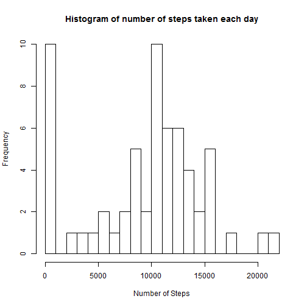
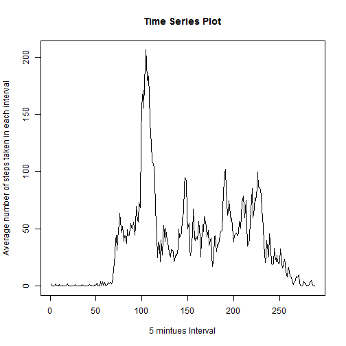
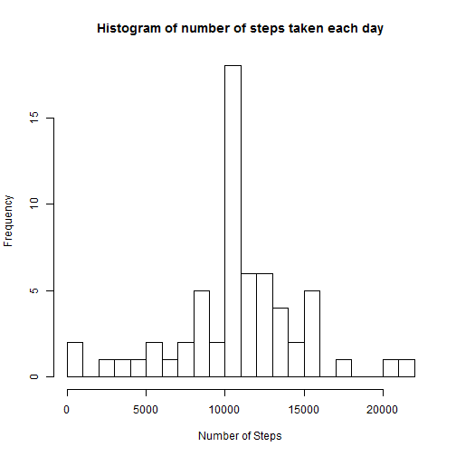
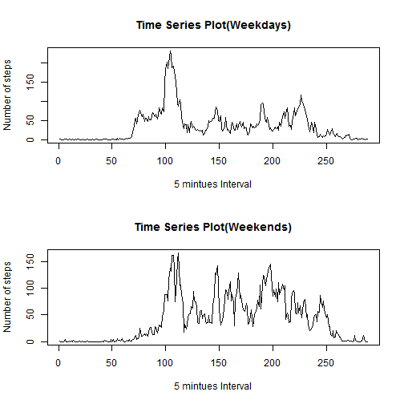

Reproducible Research : Peer Assessments 1
========================================================

### 1) Loading and preprocessing the data

 1) Loading the data

```r
data <- read.csv("activity.csv")
```

 2) Converting date column in "Date" format

```r
data[,2] <- as.Date(data[,2],'%y%y-%m-%d')
```

### 2) What is mean total number of steps taken per day?

Finding total number of steps each day

```r
total_steps= tapply(data$steps,data$date,sum,na.rm=TRUE)
```
 
 1) Make a histogram of the total number of steps taken each day 

```r
hist(total_steps,main='Histogram of number of steps taken each day',xlab='Number of Steps',ylab='Frequency',xlim=c(0,22000),breaks=22)
```

 
 
 2) Mean and Median of total number of steps taken each day
 

```r
mean.steps <-mean(total_steps,na.rm=TRUE)
```
The mean of the total number of steps taken each day is 9354.


```r
median.steps <- median(total_steps,na.rm=TRUE)
```
The median of the total number of steps taken each day is 10395.

### 3) What is the average daily activity pattern?

 1) Make a time series plot (i.e. type = "l") of the 5-minute interval (x-axis) and the average number of steps taken, averaged across all days (y-axis)
 

```r
# calculate average number of steps taken in each interval
average.steps <- tapply(data$steps,data$interval,mean,na.rm=TRUE)
plot(average.steps,type='l',xlab='5 mintues Interval',ylab='Average number of steps taken in each interval',main='Time Series Plot')
```

 

 2) Which 5-minute interval, on average across all the days in the dataset, contains the maximum number of steps?
 

```r
maxsteps_interval <- average.steps[which.max(average.steps)]
```

The 5 minute interval which have maximum number of average step across all days is 835, with 206.2 number of steps.

### 4) Imputing missing values

 1) Calculate and report the total number of missing values in the dataset (i.e. the total number of rows with NAs)
 

```r
number_of_missing_values <- sum(is.na(data$steps))
```

Number of missing values is 2304

 2 & 3) Devise a straegy for filling in all of the missing values in the dataset. Create a new dataset that is equal to the original dataset but with the missing data filled in.
 
 - We are going to fill the missing values with their average number of steps taken on each day in a particular Interval
 

```r
# Adding index to average.steps
average.steps <- as.data.frame(cbind(interval=as.numeric(names(average.steps)),avg.steps=average.steps))

#copying the data in a different dataset
data.original <- data

#Now founding missing value in Data and filling it with average number of steps in respective interval
for (i in 1:nrow(data)) {
    if (is.na(data$steps[i])) {
      data$steps[i] <- average.steps[(average.steps$interval==data$interval[i]),2]
    }
}
```

 4) Make a histogram of the total number of steps taken each day and Calculate and report the mean and median total number of steps taken per day. Do these values differ from the estimates from the first part of the assignment? What is the impact of imputing missing data on the estimates of the total daily number of steps?

 - Making a Histogram with new treated data.

```r
total_steps_new= tapply(data$steps,data$date,sum,na.rm=TRUE)
hist(total_steps_new,main='Histogram of number of steps taken each day',xlab='Number of Steps',ylab='Frequency',xlim=c(0,22000),breaks=22)
```

 

 - Calculate and report the mean and median total number of steps taken per day


```r
mean.steps_new <-mean(total_steps_new)
median.steps_new <- median(total_steps_new)
```

 a) Mean with missing value treated : 1.0766 &times; 10<sup>4</sup>
 b) Mean without missing value treated : 9354.2295
 c) Median with missing value treated : 1.0766 &times; 10<sup>4</sup>
 d) Median without missing value treated : 10395
 
Mean and median values are higher after imputing missing data. The reason is that in the original data, there are some days with steps values NA for any interval. The total number of steps taken in such days are set to 0s by default. However, after replacing missing steps values with the mean steps of associated interval value, these 0 values are removed from the histogram of total number of steps taken each day.

### 5) Are there differences in activity patterns between weekdays and weekends?

 1) Create a new factor variable in the dataset with two levels - "weekday" and "weekend" indicating whether a given date is a weekday or weekend day.
 

```r
days <- rep(NA,nrow(data))
for (i  in 1:nrow(data)) {
  if(weekdays(data$date[i]) %in% c("Monday", "Tuesday", "Wednesday", "Thursday", "Friday")) {
    days[i] <- "Weekday"
  } else {
    days[i] <- "Weekend"
  }
}
```

 2) Make a panel plot containing a time series plot (i.e. type = "l") of the 5-minute interval (x-axis) and the average number of steps taken, averaged across all weekday days or weekend days (y-axis)
 

```r
library(ggplot2)
data_weekdays <- data[days=='Weekday',]
data_weekends <- data[days=='Weekend',]
average.steps_weekdays <- tapply(data_weekdays$steps,data_weekdays$interval,mean)
average.steps_weekends <- tapply(data_weekends$steps,data_weekends$interval,mean)
par(mfrow=c(2,1))
plot(average.steps_weekdays,type='l',xlab='5 mintues Interval',ylab='Number of steps',main='Time Series Plot(Weekdays)')
plot(average.steps_weekends,type='l',xlab='5 mintues Interval',ylab='Number of steps',main='Time Series Plot(Weekends)')
```

 
